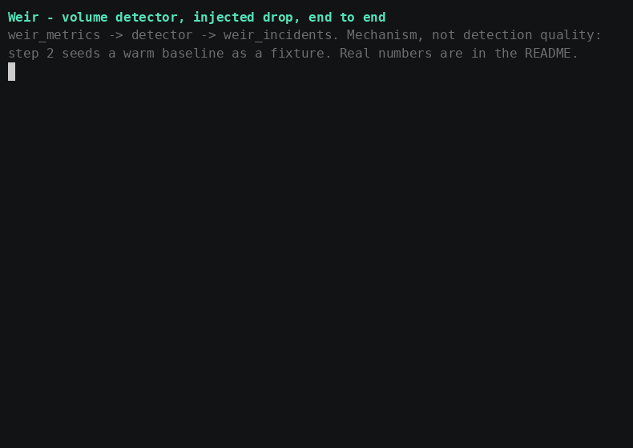

# Weir

Streaming data reliability platform. Detects, localizes, and explains data
incidents.

**Differentiator:** publishes measured detection rate, false-positive rate,
and detection latency against injected failures, benchmarked against a
reproducible failure catalog. No comparable OSS project does this.

That claim is scoped, and the scoping matters — see
[docs/prior-art.md](docs/prior-art.md) for what it does and doesn't assert
about the tools it's compared against.

Every number below was produced by running `benchmarks/run_benchmark.py`
against real NYC TLC data; none is estimated, and the block is generated
from a result file rather than typed (CLAUDE.md rule 1). The limitations
under it are part of the result, not caveats bolted on afterwards.

## Benchmark results

This table is generated by `scripts/sync_benchmark_readme.py` from the
newest file in `benchmarks/results/*.json` — never edited by hand. CI fails
if this block doesn't match a fresh regeneration.

<!-- BENCHMARK:BEGIN -->
Run: `20260915T213038Z.json` (2026-09-15T21:30:38.325502+00:00)

| Scenario | Detected | Latency (event time) |
|---|---|---|
| volume_partition_degradation | yes | 210s |
| freshness_gradual_delay | no | n/a |
| nullrate_slow_creep | no | n/a |
| duplicate_event_storm | no (expected miss) | n/a |
| out_of_order_flood | no (expected miss) | n/a |
| upstream_backfill_replay | no (expected miss) | n/a |
| slow_volume_decline | no (expected miss) | n/a |

| Measure | Value |
|---|---|
| Scenarios flagged, all (incl. expected misses) | 1/7 (14.2857%) |
| Scenarios flagged, targeted only | 1/3 (33.3333%) |
| Spurious incidents per scored window, clean replay | 1782/120489 (1.4790%) |
| Weekly samples per bucket (median, lowest detector) | 12.0 |
| Median / p95 time to flag (event time) | 210s / 210s |
| Warmed buckets over a contiguous 12.0-week span | 504 |
| Clean event-time hours covered | 2015.92 |
| Unattributed incidents, injected replay | 3291 |
<!-- BENCHMARK:END -->

### How to read the table above

These are measured, not estimated, and they are reported whole — including
the scenarios this system does not catch. Four of the seven are declared
**expected misses**: nothing in Weir targets duplicate delivery, event
reordering, upstream backfill, or a decline slow enough for the baseline
to follow it. They sit in the denominator on purpose. A detection figure
computed only over failures the detectors were built for would not mean
anything.

Four readings, each of which changes how a line above should be read:

1. **This is one run, and variance across runs is unmeasured.** V4 in
   CLAUDE.md normally requires five clean runs before a result counts,
   and it is relaxed here on purpose: the pipeline is deterministic given
   the same input, so repeating it re-verifies one scenario five times
   rather than sampling a distribution. Five earlier runs under a
   superseded sampling method bore that out — scenarios flagged, the
   spurious-incident count and the warmed-bucket count came back
   identical in all five. Two figures did move, both because whether a
   late record beats the watermark is a race between replay pacing and
   Flink's progress: time to flag, and the unattributed-incident count.
   Those are the two rows above most likely to shift on a rerun, and
   nobody has measured by how much under contiguous replay.

2. **Both misses are confirmed, with numbers — not explained away.** The
   runner records the strongest score each detector reached inside each
   scenario's declared span, against the fixed threshold of 3.5:

   | Scenario | Windows scored in span | Strongest score |
   |---|---|---|
   | volume_partition_degradation | 2177 | **5.32** → flagged |
   | freshness_gradual_delay | 763 | **0.01** |
   | nullrate_slow_creep | 2540 | **0.93** |

   Every window in every span came back `scored`, none
   `insufficient_baseline`. The baselines were warm and the detectors did
   look at the data, so these are real misses rather than windows that
   were never measured. That distinction is the whole reason the status is
   recorded per window.

3. **The freshness miss is a design limitation, and a specific one.**
   Its strongest score was 0.01 — effectively zero deviation, not a near
   miss. The detector's signal is the gap between consecutive
   `window_metrics` rows. The scenario delays events until they cross the
   270s watermark bound and get dropped. But as long as *some* events
   still land in each minute, windows keep closing once a minute and the
   arrival gap never changes. A delay failure that thins a stream without
   stopping it is invisible to a window-gap detector, by construction.
   This is the honest cost of choosing window gap as the freshness signal
   over event lateness, which was chosen because the lateness columns are
   never populated by the current pipeline (DEFENSE.md #52) — a real
   tradeoff, now with a measured consequence attached to it.

4. **The injected phase raised more unattributable incidents than the
   clean phase did** (3291 against 1782), and that is expected rather
   than alarming. Injection deliberately drops events — 101,856 of
   10,618,427, within the 324,528 the scenarios declare they may lose —
   and a drop looks to the volume detector exactly like the volume
   anomaly it exists to catch, including outside any scenario's span.
   Those incidents are counted and reported rather than filtered, because
   filtering them would need per-window expected-versus-landed accounting
   the runner does not do yet (docs/FUTURE_WORK.md).

The honest summary: one targeted failure was caught, and two were missed
for reasons now measured rather than hypothesised. Nothing was tuned to
produce these numbers — CLAUDE.md hard rule 3 forbids it, and no detector
was modified after seeing them.

**Why `nullrate_slow_creep` was missed** — confirmed, with the per-window
baseline state this time: the creep to a 60% null rate reached a strongest
score of 0.93 against the 3.5 threshold, about a quarter of the way there.
`passenger_count`'s real null rate in this dataset is both high and
variable, so the bucket's tracked dispersion is wide enough to absorb the
creep. A detector scoring the *trend* rather than each window's deviation
would catch this; this one scores deviation, and a slow creep is what that
design is worst at.

### Limitations of the method

The three below are properties of how this benchmark is built, not of any
particular run. They hold whatever the numbers say, and they are meant to
be read before the numbers are.

**1. The baselines are roughly half as mature as robust statistics wants.**
Every detector keeps one baseline per `(weekday, hour)` bucket, so a bucket
gains exactly one sample per calendar week of replayed time — the *Weekly
samples per bucket* row above is what this run actually achieved. The
guidance for a stable MAD-derived scale estimate is n ≥ 20–30 (DEFENSE.md
#44), and this does not reach it. Twenty is not reachable here, and the
reason is wall-clock rather than data availability: the TLC archive extends
back years, so a longer span could be downloaded, but the replay cannot be
extended to match. This benchmark drives real events through the full
Kafka/Flink/Postgres path instead of simulating the pipeline, the span used
here already takes hours, and a span long enough for n ≥ 20 runs past the
six-hour ceiling on a single GitHub Actions job, which is where this
benchmark executes. The two ways out are a different execution environment
or a higher compression ratio — and compressing harder stops exercising the
watermark and lag-buffer semantics the pipeline depends on, trading a known
limitation for a hidden one. Neither is a change to a detector, and neither
was made. Limitation 3 follows directly from this one.

**2. The failure catalog is self-authored, which is not the same as
independent.** The scenarios in `incidents/benchmark/` were written by the
same author as the detectors they score. Four structural countermeasures
are in place: the benchmark scenarios are deliberately variants the
detectors were *not* built against rather than restatements of the
development fixtures; `benchmarks/` is mechanically forbidden from
importing `incidents/dev/`, enforced by a test, so the two cannot quietly
converge; four of the seven scenarios are declared expected misses that no
detector targets, and they stay in the denominator; and no detector was
modified after any result was seen (CLAUDE.md hard rule 3). What none of
that buys is independence. The scenarios that got written are correlated
with the failure modes their author thought to defend against, and a
failure mode nobody imagined is absent from the detectors and from the
catalog alike — costing nothing here and everything in production. Read
these figures as measuring the detectors against this catalog. They are
not a claim about production incident coverage, and an external suite
would be a different and better test.

**3. The spurious-incident figure is an upper bound.** Two effects push it
up and neither pushes it down. First, limitation 1: a scale estimate built
from too few weekly samples is itself noisy, and that noise sits in the
denominator of the z-score, so clean data crosses the threshold more often
than it would against a mature baseline. Second, the clean phase is real
TLC data, not a synthetic quiet stream — it contains genuine traffic
anomalies (weather, holidays, irregular events) that nobody labelled, and
an incident raised on one of those is counted against the detector here
even though flagging it is arguably correct behaviour. Both effects are
directional, not quantified: they say which way the bias runs, not how far.
The honest reading is that the true false-positive rate — against a mature
baseline and a labelled clean stream — is more likely below the published
figure than above it. That is a statement about the bound, not a
substitute for measuring it.

## Demo

The volume detector flagging an injected drop, end to end:
`weir_metrics` → detector → `weir_incidents`.

This is the *mechanism*, not evidence of detection quality — the baseline
is seeded as a fixture so the recording stays short, and the real numbers
are the measured ones above. The recording is generated by
`.github/workflows/demo-gif.yml` running `scripts/demo.sh` against a live
stack, so it is genuine output rather than a mock-up.
[docs/demo.md](docs/demo.md) is the same walkthrough as text, with what
each step is for and what its failure modes mean.

## Status

Sprint 1 is in progress. Infrastructure (Kafka, PostgreSQL, SeaweedFS,
Flink, via Docker Compose) is up, a Flink job aggregates real NYC TLC
trips into per-minute window metrics, and three detectors read those
metrics from Postgres:

| Detector | Signal | Verified against real data |
|---|---|---|
| volume | rows per window | yes |
| freshness | arrival gap between windows | yes |
| null-rate | nulls per column per window | yes |

Each has a dev trigger in `incidents/dev/` for a fast local loop, and a
dispatch-only CI workflow that runs it against a real month of TLC data.
The benchmark harness (`benchmarks/run_benchmark.py`, with the failure
catalog in `incidents/benchmark/`) is built, and the run reported above
replays a contiguous 12-week slice of real TLC data twice — once clean to
get a spurious-incident denominator, once with the catalog injected.
[docs/demo.md](docs/demo.md) is a 60-second walkthrough of one detector
firing, end to end.

Lineage is still declared rather than runtime-emitted (below), and the
triage agent, Terraform and dashboards remain out of scope.

See [docs/FUTURE_WORK.md](docs/FUTURE_WORK.md) for what's explicitly out of
Sprint 1 scope, and why.

## Design decisions: a correctness guarantee that was silently void

The full log of design decisions is in [DEFENSE.md](DEFENSE.md). This one
is here because it is the most interesting thing in the repository, and
because of how it was found.

Each detector writes one window in one transaction. The rationale is
ordinary: a crash partway through a batch should roll back cleanly and
leave that single window to be reprocessed next run, exactly once, with
`scored_windows`' primary key rejecting a genuine double-attempt. That
was written down, reviewed, and relied on.

It was also false, for as long as it was documented.

The function that fetches eligible windows runs a query on a connection
created with `autocommit=False`. psycopg opens a transaction on the first
statement and does not close it, and psycopg's `transaction()` context
manager **nests as a SAVEPOINT when a transaction is already open**. So
the real shape of the scoring loop was not N transactions. It was one
transaction containing N savepoints, committing nothing until the very
end. A crash would have discarded the entire run, not one window.

**Every score it produced was correct.** That is why it survived review:
the bug had no effect on output, only on durability — and on speed, which
is how it eventually surfaced.

Two benchmark runs were killed at the six-hour CI ceiling. The natural
reading was that the replay was simply too long, and the contiguous span
was cut from twelve weeks to ten to compensate. That was wrong: the
replay took 1h12m. The time was going into scoring, and two plausible
explanations were measured before anything was changed. Turning off
`synchronous_commit` made no difference whatsoever — 1.00x. Running
against a database several times larger than Postgres' buffer pool made
it marginally *faster*. Both hypotheses were dead.

The flat `synchronous_commit` result was the actual clue. A loop
committing sixty thousand transactions should care about whether commits
are flushed to disk. One that does not care is probably not committing.

Adding progress reporting to the scoring loop settled it. The scoring
rate decayed steadily — starting near 172 windows/s and reaching about 14
— and, decisively, **reset to full speed at every detector boundary**:
171.6, then 172.6, then 161.5. Table bloat and database growth accumulate
monotonically across a run and cannot reset. A cost that scales with the
number of savepoints in the current transaction resets exactly when a new
transaction begins, which is what each detector's fetch was doing.
Postgres caches 64 subtransactions per backend and spills to an on-disk
structure past that, so each window was paying for every window before it.

The fix ends the fetch's read-only transaction before the write loop
starts. It is one line per detector. The rejected alternative — batching
windows per transaction only in the benchmark — would have recovered the
speed while leaving the documented per-window durability boundary wrong,
and would have made the benchmark measure a code path that does not ship.

Two things are worth taking from this. First, a performance
investigation found a correctness defect, because the two had the same
root cause; the speed was the only symptom the bug was willing to show.
Second, and more useful: nothing in the test suite had ever killed a
detector mid-loop, so a promise about crash recovery went unverified for
its entire life. **An untested guarantee is a claim, not a property.**
There is now a test that SIGKILLs a detector partway through a batch and
asserts it resumes from the last committed window, scoring every eligible
window exactly once
([tests/integration/test_detector_crash_resumability.py](tests/integration/test_detector_crash_resumability.py)).
It is written so that it fails against the old code, where a kill left
zero committed windows.

## Lineage: declared, not runtime-emitted, in v1

**v1 ships declared, static lineage — not jobs instrumented to emit
lineage events at execution time.** Runtime lineage emission is deferred
(see docs/FUTURE_WORK.md); when it ships, its event shape is modeled on the
OpenLineage spec (see PROVENANCE.md's design references).

This is the fallback CLAUDE.md rule 7 requires be disclosed here, not just
in internal docs.

## Stack and rules

See [CLAUDE.md](CLAUDE.md) for the locked stack and the hard rules this
project is built under, and [DEFENSE.md](DEFENSE.md) for the running log of
design decisions, alternatives, and tradeoffs behind it.

